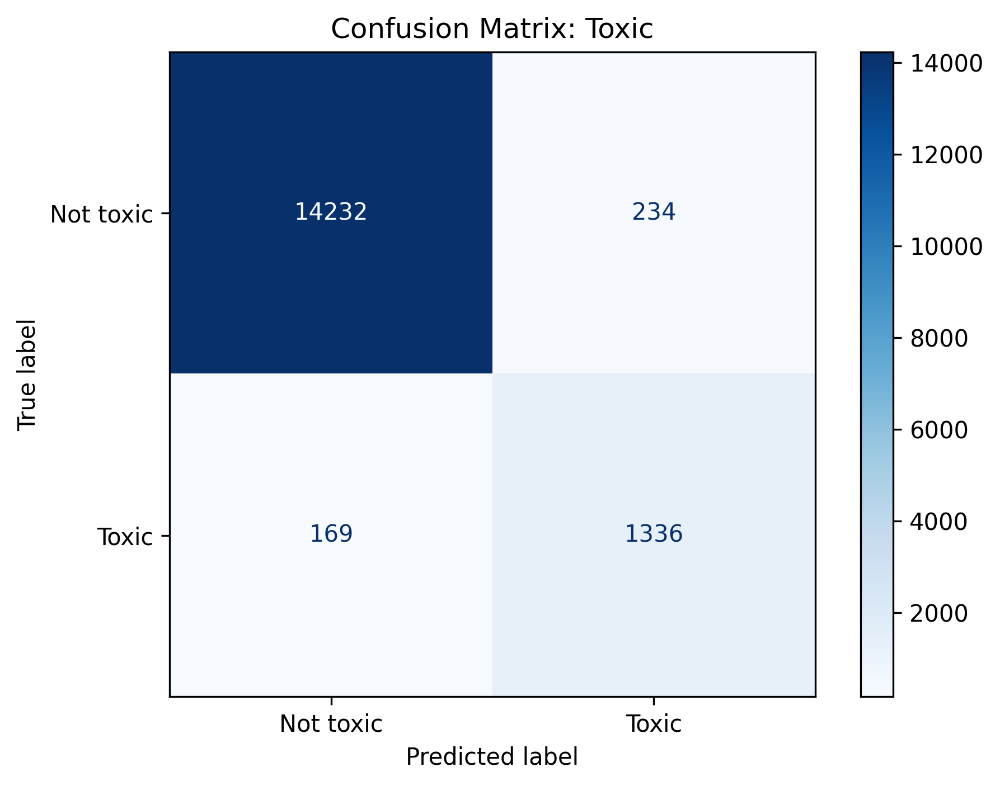
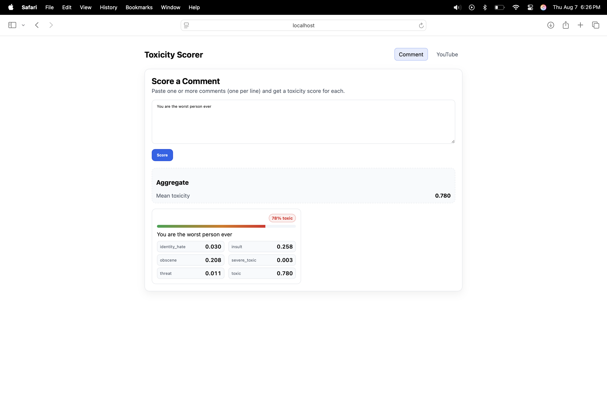
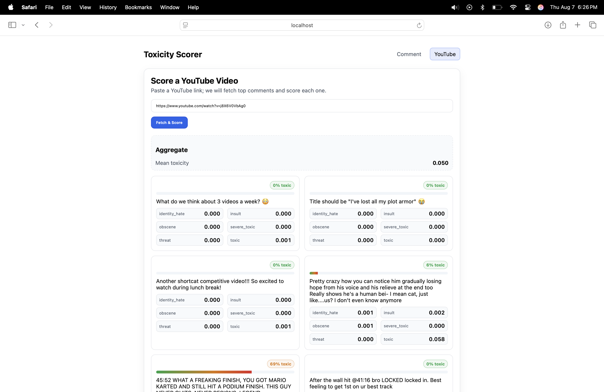

# Guardian Comments - Toxic Comment Analysis

A full-stack application for analyzing and detecting toxic comments using machine learning. This project includes a React frontend, Flask backend, and trained models for toxicity detection.

## Project Structure

```
guardian-comments/
├── app/                   
│   ├── backend/           # Flask backend server
│   └── frontend/          # React frontend application
├── docs/                  # Documentation and examples
├── src/                   # Model training and evaluation
└── jigsaw-toxic-comment-classification-challenge/ 
```

## Modeling

The classifier was trained use the Jigsaw Toxic Comment Classification Challenge, sourced from a kaggle competition, and supprts mutli-label classification for the following categories:
- toxic
- severe_toxic
- obscene
- threat
- insult
- identity_hate

### Architecture

The model uses a Bidirectional LSTM-based neural network with the following layers:
1) Embedding(vocab_size + 1, 32, input_length=1800)
2) Bidirectional(LSTM(32, activation='tanh'))
3) Dense + Dropout stack:
    - Dense(128, activation='relu') -> Dropout(0.3)
    - Dense(256, activation='relu') -> Dropout(0.3)
    - Dense(128, activation='relu') -> Dropout(0.3)
4) Output Layer:
    - Dense(6, activation='sigmoid') for multi-label classification

### Model Training

The project includes Jupyter notebooks for training and evaluating the toxicity detection model:

- `src/train_toxicity.ipynb`: Train the model on the Jigsaw dataset
- `src/predict_toxicity.py`: Standalone script for making predictions

### Evaluation

The model used in the application was trained for 3 epochs. It was then evaluated on the test set using standard mutli-label classification metrics:
- Accuracy = 0.9935
- Loss = 0.0395
- Precision = 0.8555
- Recall = 0.7224
- F1-Score = 0.7833

The confusion matrix below above corresponds to the "toxic" class, one of the six toxicity labels. Each cell in the matrix provides a count of predictions:
- True Negatives (Top-left, 14,232): Non-toxic comments correctly identified as non-toxic.
- False Positives (Top-right, 234): Non-toxic comments incorrectly labeled as toxic.
- False Negatives (Bottom-left, 169): Toxic comments incorrectly labeled as non-toxic.
- True Positives (Bottom-right, 1,336): Toxic comments correctly identified as toxic.

Overall, the model is conservative in labeling toxicity. This means it is more likely to label non-toxic comments as toxic than toxic as non-toxic. This aspect of the model, although desirable to have no false positvies or negatives, seems better than having a reverse relationship. If applied to real-world scenario, such as monitoring a forum of familt friendly event, this would allow the developers to be the more confident that no toxic or obscene comments are made. 

<p align="center">
  
</p>

### Improvements

1) Class Imbalance Handling
    - The dataset is heavily skewed toward non-toxic labels.
    - Solutions:
        - Weight the class during training
        - Oversampling rare classes or undersampling dominant ones
2) Better Tokenization and Embeddings
    - The model currently uses TextVectorization with integer encoding and an embedding layer.
    - Improvements: 
        - Pretrained embeddings
        - Subword or character-level embeddings
        - BERT-style contextual embeddings

## Usage Examples

### Comment Analysis
When analyzing comments, the system provides toxicity scores and classifications:



### Link Processing
The application can analyze comments direct Youtube links via the Youtube Data API:



## Future Work
- Refine and optimize the model
- Allow for support from other platform link in addition to Youtube
- Explore data surronding the comments labeled toxic: Do they get mroe like than non-toxic, are there certain reasons for higher toxic comment rates, etc.